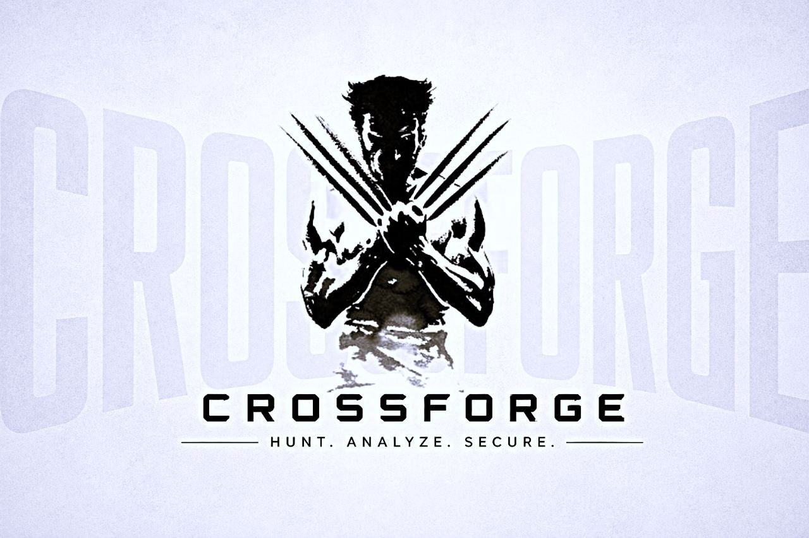

<p align="center">
  
</p>

<h1 align="center">CrossForge</h1>
<h3 align="center">Autonomous SSRF Detection · Exploit · Verify Agent</h3>

<p align="center">
  
  
  
  
  
</p>

<p align="center">
  <b>10-Phase Pipeline &nbsp;·&nbsp; Differential Probing &nbsp;·&nbsp; OOB-Verified &nbsp;·&nbsp; Chain-Pivoting &nbsp;·&nbsp; Zero False Positives</b>
</p>

---

## Overview

CrossForge is an enterprise-grade autonomous SSRF (Server-Side Request Forgery) detection, exploitation, and verification agent built for modern web targets. It pairs a SPA-aware native crawler with a 10-phase detection pipeline that triage, baseline, classify, fingerprint, probe, and verify every SSRF-plausible parameter on the target — stopping only when a confirmed finding is produced or all vectors are exhausted.

Every finding is verified via differential z-score analysis or out-of-band callback confirmation, timestamped, and delivered with a ready-to-run `curl` PoC and a SARIF 2.1.0 report.

---

## Features

- **10-Phase Autonomous Pipeline** — Surface Triage → Baseline → Context Classify → WAF Fingerprint → Differential Probe → OOB Correlation → Evidence Engine → Chain/Pivot → Confidence Score → Adaptive Feedback
- **Native BFS Crawler** — Read-only crawl with JS static analysis, form parsing, and OpenAPI/Swagger auto-discovery; no spider file required
- **Differential Probing** — z-score anomaly detection on timing, content-length, redirect depth, and status code — capped at `10.0` with a 2-dimension noise floor to eliminate false positives
- **OOB Blind SSRF Confirmation** — Per-candidate Interactsh tokens; async pattern detection for FIRM-tier findings without guessing
- **Evidence Engine** — Cloud IMDS (AWS/GCP/Azure), Kubernetes API, ECS Metadata, Oracle Cloud, Redis/Memcached banner, file read — schema-matched artifact extraction for CERTAIN-tier confirmation
- **WAF Fingerprinting & Evasion** — 11 vendor signatures (Cloudflare, Akamai, AWS WAF, Imperva, F5, etc.) with per-vendor adaptive mutation chains
- **Chain / Pivot Detection** — Second-order SSRF, DNS rebinding detection, K8s/ECS lateral pivot, up to `max_hops=3` depth
- **Confidence Scoring System** — 4-tier confidence model (TENTATIVE → FIRM → CERTAIN → CRITICAL+) with known-exploit escalation and reduction caps
- **Authenticated Scanning** — Cookie, Bearer token, API key injection; auto-detected from spider headers
- **Adaptive Feedback Loop** — Pattern propagation across candidates, WAF chain caching, IMDSv2 token escalation between phases
- **Structured Reporting** — JSON + SARIF 2.1.0 output; `curl` PoC per finding; CVSS scores per tier

---

## Installation

```bash
git clone https://github.com/project-hellhound-org/RFDagent.git crossforge
cd crossforge
chmod +x install.sh
./install.sh
```

Requires Python 3.10+. Creates an isolated `.venv` and links `crossforge` globally via `/usr/local/bin/crossforge`.

```bash
# Manual install (development editable mode)
python3 -m venv .venv
source .venv/bin/activate
pip install -e .

# Verify installation
crossforge --version
```

---

## Usage

```bash
# Basic detect scan from Hellhound Spider JSON file
crossforge --input spider_output.json http://target.com

# No spider file — CrossForge crawls the target itself
crossforge http://target.com

# Native crawl scoped to an extra API subdomain, deeper BFS
crossforge http://target.com --crawl-scope api.target.com --crawl-depth 8

# With OOB for blind SSRF confirmation (FIRM tier findings)
crossforge --input spider.json --oob https://oast.pro

# Authenticated scan — Bearer token (JWT)
crossforge --input spider.json --bearer eyJhbGciOiJIUzI1NiJ9...

# Authenticated scan — Cookie + API key
crossforge --input spider.json --cookie session=abc123 --api-key sk-prod --api-key-header X-Api-Key

# Full pentest: OOB + auth + Burp proxy intercept
crossforge --input spider.json \
           --oob https://oast.pro \
           --bearer eyJhbGciOiJIUzI1NiJ9... \
           --proxy http://127.0.0.1:8080

# Exploit mode — unlocks Gopher/Dict protocol probing (requires YES acknowledgment)
crossforge --input spider.json --mode detect_exploit

# Quiet CI/CD pipeline mode
crossforge --input candidates.json --quiet --output /tmp/crossforge-results

# Verbose mode — show all candidate decisions
crossforge --input spider.json --verbose

# Rate limiting + custom timeout
crossforge --input spider.json --rate 10 --timeout 15
```

---

## Input Formats

CrossForge supports three input modes that all converge on the same triage and filter pipeline:

| Mode | Flag | Description |
|------|------|-------------|
| **Spider JSON** (recommended) | `--input spider.json` | Output from [Hellhound Spider](https://github.com/project-hellhound-org/X5Sentry). Auto-detected by `endpoints` + `meta` keys. Provides full surface coverage. |
| **Flat Candidate Array** | `--input candidates.json` | JSON array of explicit candidate objects. Each entry requires `url`, `method`, `parameter`, `location`. |
| **Native Crawl** | *(no `--input`)* | Provide a target URL only. CrossForge crawls the target via BFS, form parsing, and static JS analysis — then feeds discovery through the same pipeline. |

---

## 10-Phase Pipeline

| Phase | Name | What it does |
|-------|------|-------------|
| `00` | **Surface Triage** | Pre-score all candidates HIGH/MEDIUM/LOW via `prescore.py`; drop zero-score entries before any I/O |
| `01` | **Baseline Collection** | 5 clean samples per candidate; auth-redirect detection; infra-noise fingerprinting via `InfraNoiseTracker` |
| `02` | **Context Classifier** | Classify each candidate as `fetch_url` / `redirect` / `file_include` / `crlf_injection` / `host_header` |
| `03` | **WAF Fingerprint** | 11 vendor signatures; score-based matching; per-vendor adaptive mutation chains via `waf_detector.py` |
| `04` | **Differential Probe** | z-score anomaly on timing, redirect depth, status code, content-length (cap 10.0, 2-dim floor) |
| `05` | **OOB Correlation** | Per-candidate Interactsh token injection; async callback polling; DNS/HTTP pattern matching |
| `06` | **Evidence Engine** | AWS IMDS, GCP metadata, Azure IMDS, K8s API, ECS, Oracle Cloud, Redis/Memcached, file-read probing |
| `07` | **Chain / Pivot** | Second-order SSRF; DNS rebinding detection; K8s/ECS lateral pivot; `max_hops=3` recursion |
| `08` | **Confidence Scoring** | Known-exploit registry escalation; reduction caps; per-candidate final tier assignment |
| `09` | **Reporter** | JSON report + SARIF 2.1.0; `curl` PoC per finding; CVSS per tier; timestamped artifacts |
| `10` | **Adaptive Feedback** | Pattern propagation across candidates; WAF chain caching; IMDSv2 token escalation |

---

## Confidence Tiers

| Tier | Signal | CVSS | Severity |
|------|--------|------|----------|
| `TENTATIVE` | Differential anomaly detected — no external confirmation | 4.3 | Medium |
| `FIRM` | OOB callback confirmed — server made outbound request | 6.5 | High |
| `CERTAIN` | Schema-matched evidence artifact (IMDS body, Redis banner, K8s version) | 8.6 | Critical |
| `CRITICAL+` | Chained SSRF, K8s API access, or known-exploitable internal service reached | 9.6 | Critical |

---

## Scan Modes

| Mode | Flag | Description |
|------|------|-------------|
| `detect` | *(default)* | Read-only detection. Safe for production targets. All 10 phases active but evidence collection restricted to non-destructive operations only. |
| `detect_exploit` | `--mode detect_exploit` | Unlocks Gopher/Dict protocol banner probing. Still read-only. Requires operator `YES` acknowledgment at runtime. **Pentest-only.** |

---

## Components

| Module | Role |
|--------|------|
| `crossforge/main.py` | CLI entry point — argument parsing, config loading, orchestration |
| `crossforge/agent.py` | Core orchestrator — 10-phase pipeline runner with per-phase console output |
| `crossforge/crawler.py` | Native BFS crawler — BFS, form parsing, JS static analysis, sitemap/robots.txt |
| `crossforge/spider_adapter.py` | Converts Hellhound Spider JSON or flat arrays into scored `Candidate` objects |
| `crossforge/prescore.py` | Phase 00 — relevance scoring and triage queue ordering |
| `crossforge/baseline.py` | Phase 01 — baseline profiling, infra-noise tracking, auth-redirect detection |
| `crossforge/context_classifier.py` | Phase 02 — parameter context classification into 5 SSRF context classes |
| `crossforge/waf_detector.py` | Phase 03 — 11 WAF vendor fingerprinting with adaptive evasion mutation chains |
| `crossforge/differential.py` | Phase 04 — z-score statistical anomaly probing engine |
| `crossforge/oob_hub.py` | Phase 05 — Interactsh OOB token lifecycle management and async polling |
| `crossforge/evidence_engine.py` | Phase 06 — cloud metadata, Kubernetes API, Redis/Memcached, file-read extraction |
| `crossforge/chaining.py` | Phase 07 — second-order SSRF pivot, DNS rebinding detection |
| `crossforge/scoring.py` | Phase 08 — confidence tier assignment and reduction cap enforcement |
| `crossforge/reporter.py` | Phase 09 — JSON + SARIF 2.1.0 report generation and `curl` PoC builder |
| `crossforge/feedback.py` | Phase 10 — cross-candidate pattern propagation and adaptive chain caching |
| `crossforge/http_client.py` | Async HTTP engine with rate limiting, proxy support, redirect handling |
| `crossforge/models.py` | Core data models — `Candidate`, `ProbeResult`, `BaselineProfile`, `ScanReport`, etc. |
| `crossforge/payload_engine.py` | SSRF payload construction — Gopher, Dict, cloud metadata URLs, mutation chains |
| `crossforge/auth_manager.py` | Authentication injection — Bearer, Cookie, API key; spider header auto-detection |
| `crossforge/loader.py` | Input file ingestion — Spider JSON and flat candidate array format parsing |
| `crossforge/console.py` | Terminal UI — Cyber Tactical HUD, phase headers, status board, colour system |
| `crossforge/known_exploits.py` | Known-exploit registry — escalation rules for internal services and cloud APIs |
| `crossforge/openapi_adapter.py` | OpenAPI/Swagger spec auto-discovery and candidate generation |
| `crossforge/graphql_adapter.py` | GraphQL introspection-based SSRF surface extraction |
| `crossforge/dns_intel.py` | DNS intelligence gathering for rebinding and pivot analysis |
| `crossforge/js_intel.py` | Static JS analysis — `fetch`/`axios`/`XHR` string literal extraction |
| `crossforge/recon_quality.py` | Crawler output quality scoring and coverage gap detection |
| `crossforge/wayback_probe.py` | Wayback Machine historical endpoint discovery |
| `crossforge/subdomain_enum.py` | Subdomain enumeration for crawl scope expansion |
| `crossforge/spa_detector.py` | SPA framework detection — React, Angular, Vue, Next.js |
| `crossforge/vuln_classifier.py` | Post-probe vulnerability classification and severity mapping |
| `crossforge_run.py` | Root-level CLI wrapper — delegates to `crossforge.main:main` |
| `install.sh` | High-fidelity installer — creates `.venv`, installs deps, deploys global command |

---

## CLI Reference

```
crossforge [OPTIONS] <target_url>
crossforge --input <spiderfile.json> [target_url] [OPTIONS]

Authentication:
  --bearer TOKEN          Bearer/JWT token injected into every request
  --api-key KEY           API key value
  --api-key-header HDR    Header name for --api-key (default: X-Api-Key)
  --cookie NAME=VALUE     Session cookie (repeatable)

OOB:
  --oob URL               Interactsh server for blind SSRF confirmation

Crawl (when --input is omitted):
  --crawl-depth N         BFS max depth (default: 5)
  --crawl-max-pages N     Page budget (default: 40, ceiling: 400)
  --crawl-scope HOST      Extra in-scope host (repeatable)
  --no-crawl-js           Disable static JS analysis

Scan Control:
  --mode MODE             detect (default) | detect_exploit
  --rate N                Requests per second (default: 20)
  --timeout N             Per-request timeout in seconds (default: 10)
  --max-hops N            SSRF chain depth limit (default: 3)
  --no-openapi            Disable OpenAPI/Swagger auto-discovery
  --proxy URL             HTTP proxy (e.g. http://127.0.0.1:8080)
  --config PATH           Path to config.yaml

Output:
  --output DIR            Report directory (default: ./reports)
  --verbose               Show all candidates including clean/skipped
  --quiet                 Suppress banner and status board
```

---

## Requirements

```
httpx[http2]>=0.27.0
PyYAML>=6.0.1
rich>=13.7.1

# Optional — headless rendering for SPA targets
playwright>=1.44.0
```

---

## Legal

CrossForge must only be used against systems you are **explicitly authorized to test**. Unauthorized use may violate the Computer Fraud and Abuse Act (CFAA), the Computer Misuse Act, and equivalent laws in your jurisdiction.

> This tool is intended solely for authorized security assessments, red-team engagements, and security research.

---

<p align="center">
  Built by <b>Hellhound Security</b> &nbsp;·&nbsp; Part of the <a href="https://github.com/project-hellhound-org">Project Hellhound</a> toolkit
</p>
