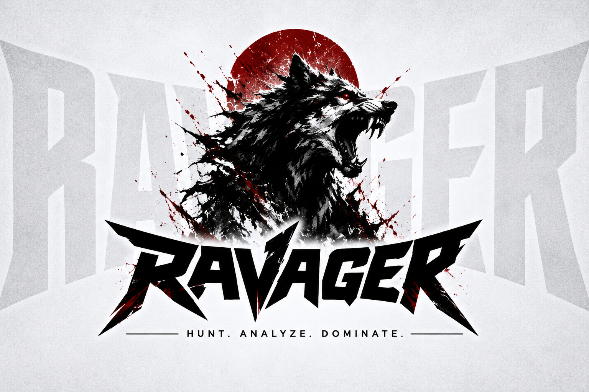

<p align="center">
  
</p>

<p align="center">
  <h1 align="center">RAVAGER</h1>
  <p align="center"><b>Request Analysis & Validation Agent for Gateway Exploitation Research</b></p>
  <p align="center">Autonomous SSRF Detection · Exploitation · Verification</p>
  <p align="center">
    
    
    
  </p>
</p>

---

## What is RAVAGER?

RAVAGER is an enterprise-grade autonomous SSRF (Server-Side Request Forgery) agent that runs a **10-phase pipeline** against every SSRF-plausible parameter on a target — from surface triage and differential probing through OOB correlation, evidence collection, chain pivoting, and exploit module execution.

### Key Capabilities

- **10-Phase Detection Pipeline** — Surface triage → baseline → context classification → WAF fingerprinting → differential probing → OOB correlation → evidence collection → chain pivoting → confidence scoring → adaptive feedback
- **12 Exploit Modules** — Redis, Docker, PostgreSQL, FastCGI, MySQL, Memcached, Tomcat (Ghostcat), Zabbix, SMTP, cloud metadata (AWS/GCE/Azure/DO/Alibaba), port scanning, file reads
- **3-Mode Exploitation** — `default` (low-impact auto), `exploit_chain` (full RCE suite), `no` (detection only)
- **Native Crawling** — No spider file required. BFS crawler with form parsing, JS analysis, GraphQL/OpenAPI discovery
- **DNS Rebinding** — TOCTOU bypass detection via controlled DNS resolution flipping
- **Confidence Scoring** — 4-tier model: `TENTATIVE` → `FIRM` → `CERTAIN` → `CRITICAL+`
- **SARIF Output** — CI/CD-compatible reports for GitHub Advanced Security, VS Code

---

## Quick Start

```bash
# Install
git clone https://github.com/project-hellhound-org/RAVAGER.git ravager
cd ravager
chmod +x install.sh && ./install.sh

# Scan with cookie auth (verbose + auto-exploit ON by default)
rage --cookie 'session=YOUR_SESSION_COOKIE' http://target.com

# Scan with OOB for blind SSRF confirmation
rage --cookie 'session=abc123' --oob https://oast.pro http://target.com

# Full exploitation mode
rage --cookie 'session=abc123' --mode exploit_chain http://target.com
```

Requires **Python 3.10+**. The installer creates `.venv`, installs dependencies, and links `rage` globally.

```bash
# Manual install (editable dev mode)
python3 -m venv .venv && source .venv/bin/activate
pip install -e .

# Verify
rage --version
```

---

## Usage

```bash
# Target URL only — RAVAGER crawls it automatically
rage http://target.com

# Spider file input
rage --input spider.json http://target.com

# Authenticated scan with Bearer token
rage --bearer eyJhbGciOiJIUzI1NiJ9.xxx http://target.com

# API key auth
rage --api-key sk-abc123 --api-key-header X-Api-Key http://target.com

# Multiple cookies
rage --cookie 'session=abc' --cookie 'csrf=xyz' http://target.com

# Pentest mode: OOB + auth + Burp intercept
rage --cookie 'session=abc' --oob https://oast.pro \
     --proxy http://127.0.0.1:8080 http://target.com

# Full exploit chain with per-action confirmation
rage --mode exploit_chain --cookie 'session=abc' http://target.com

# Quiet mode for CI/CD
rage --quiet --input candidates.json --output /tmp/ravager-ci
```

---

## Scan Modes

| Mode | Flag | Behavior |
|------|------|----------|
| **detect** | `--mode detect` | Read-only detection. Safe for production. |
| **default** *(auto)* | `--mode default` | Low-impact evidence collection (Redis INFO, cloud metadata, /etc/hostname). Runs automatically after detection. |
| **exploit_chain** | `--mode exploit_chain` | Full RCE exploitation. Each destructive action requires operator `YES` confirmation. |
| **no** | `--mode no` | Detection only, skip all exploitation. Report from anomaly/OOB findings. |

---

## 10-Phase Pipeline

| Phase | Name | What It Does |
|-------|------|-------------|
| `00` | **Surface Triage** | Pre-score all candidates HIGH/MEDIUM/LOW; SSRF vuln-type classification |
| `01` | **Baseline** | 5 clean samples per candidate; infra-noise detection; auth-redirect detection |
| `02` | **Context Classifier** | Classify parameter context: fetch_url / redirect / file_include / crlf / host_header |
| `03` | **WAF Fingerprint** | 11 WAF vendor fingerprints with per-vendor mutation chains |
| `04` | **Differential Probe** | z-score anomaly on timing, redirect, status, content-length |
| `05` | **OOB Correlation** | Interactsh token-per-candidate; async pattern detection; stored SSRF daemon |
| `06` | **Evidence Engine** | Cloud IMDS, K8s API, Redis/Memcached banner, file read, CRLF injection |
| `07` | **Chain / Pivot** | Second-order SSRF; DNS rebinding TOCTOU; max_hops=3 depth |
| `08` | **Confidence Scoring** | Known-exploit escalation; confidence-reduction caps |
| `09` | **Reporter** | JSON + SARIF 2.1.0; `curl` PoC per finding; deduplication |
| `10` | **Adaptive Feedback** | Cross-candidate pattern propagation; WAF chain caching; IMDSv2 escalation |

---

## Exploit Modules (12 services, 42 techniques)

| Module | Service | Ports | Read-Only | Destructive | CVEs |
|--------|---------|-------|-----------|-------------|------|
| cloud_metadata | AWS/GCE/Azure/DO/Alibaba | 80 | 5 | 0 | — |
| redis | Redis | 6379 | 3 | 3 | CVE-2022-0543 |
| docker | Docker Engine | 2375 | 3 | 1 | — |
| postgres | PostgreSQL | 5432 | 2 | 2 | CVE-2019-9193 |
| fastcgi | PHP-FPM | 9000 | 1 | 2 | — |
| mysql | MySQL | 3306 | 2 | 0 | — |
| memcached | Memcached | 11211 | 3 | 1 | — |
| tomcat | Tomcat | 8005/8009/8080 | 1 | 2 | CVE-2020-1938 |
| zabbix | Zabbix Agent | 10050 | 4 | 1 | — |
| smtp | SMTP | 25, 587 | 2 | 1 | — |
| portscan | Internal scan | — | 1 | 0 | — |
| readfiles | file:// | — | 1 | 1 | — |

---

## Input Formats

| Mode | Flag | Description |
|------|------|-------------|
| **Spider JSON** *(recommended)* | `--input spider.json` | Output from [RAVAGER Spider](https://github.com/project-hellhound-org/RAVAGER-Spider). Auto-detected by `endpoints` + `meta` keys. |
| **Flat Candidate Array** | `--input candidates.json` | JSON array of candidate objects. Each requires `url`, `method`, `parameter`, `location`. |
| **Native Crawl** | *(no `--input`)* | Give a target URL only. RAVAGER BFS-crawls, parses forms and JS, probes predictable paths, discovers GraphQL/OpenAPI. |

---

## CLI Reference

```
rage [OPTIONS] <target_url>
rage --input <spiderfile.json> [target_url] [OPTIONS]
rage --review <report.json>

Authentication:
  --bearer TOKEN          Bearer/JWT token
  --api-key KEY           API key value
  --api-key-header HDR    Header name for --api-key (default: X-Api-Key)
  --cookie NAME=VALUE     Session cookie (repeatable)

OOB (Out-of-Band):
  --oob URL               Interactsh server URL for blind SSRF confirmation
  --oob-wait SECONDS      Post-scan OOB daemon polling duration (default: 60s)

Crawl & Recon (when --input is omitted):
  --crawl-depth N         BFS max depth (default: 5)
  --crawl-max-pages N     Starting page budget (default: 40)
  --crawl-scope HOST      Extra in-scope host (repeatable)
  --no-crawl-js           Disable static JS endpoint extraction

Scan Control:
  --mode MODE             detect | default | exploit_chain | no
  --rate N                Requests per second (default: 25)
  --timeout N             Per-request timeout in seconds (default: 8)
  --max-hops N            SSRF chain depth limit (default: 3)
  --dns-rebind            Enable DNS rebinding TOCTOU server
  --no-openapi            Disable OpenAPI/Swagger auto-discovery
  --proxy URL             HTTP proxy (e.g. http://127.0.0.1:8080)
  --config PATH           Path to config.yaml

Output:
  --output DIR            Report output directory (default: ./reports)
  --verbose, -v           Show all candidates (ON by default)
  --no-verbose            Suppress verbose candidate output
  --quiet, -q             Suppress banner and status board
  --review REPORT_JSON    Interactive review of pending proposals

Info:
  --version               Show version
  --help, -h              Show help
```

---

## Configuration (`core/config.yaml`)

```yaml
scan_mode: detect          # detect | default | exploit_chain

exploitation:
  auto_default: true       # auto-run low-impact evidence (no prompt)

scan:
  concurrency: 10

oob:
  server_url: null         # e.g. "https://oast.pro"
  poll_interval: 5.0
  oob_wait: 60

rate_limit:
  requests_per_second: 25.0

crawl:
  max_pages_floor: 40
  max_pages_ceiling: 400
  max_depth: 5
  headless_enabled: true

path_probe:
  enabled: true

file_upload_probe:
  enabled: true
  file_types: [svg, docx, xml]
```

---

## Output Files

| File | Format | Description |
|------|--------|-------------|
| `ravager_report.json` | JSON | Full scan report — findings, proposals, action log |
| `ravager_report.sarif` | SARIF 2.1.0 | CI/CD-importable — GitHub Advanced Security, VS Code |
| `evidence/` | Per-finding | Raw evidence artifacts from evidence collection |

---

## Confidence Tiers

| Tier | Meaning |
|------|---------|
| **TENTATIVE** | Differential anomaly detected. Needs manual review. |
| **FIRM** | OOB callback confirmed — server made outbound request. |
| **CERTAIN** | Schema-matched evidence artifact (IMDS, Redis banner, etc.). |
| **CRITICAL+** | Chained SSRF, K8s API, or known-exploitable service reached. |

---

## Requirements

```
httpx[http2]>=0.27.0
PyYAML>=6.0.1
rich>=13.7.1
dnslib>=0.9.24
```

---

## Legal

RAVAGER must only be used against systems you are **explicitly authorized to test**. Unauthorized use may violate the Computer Fraud and Abuse Act (CFAA), the Computer Misuse Act, and equivalent laws in your jurisdiction.

> This tool is intended solely for authorized security assessments, red-team engagements, and security research.

---

<p align="center">
  Built by <b>Project Hellhound</b> &nbsp;·&nbsp; Part of the <a href="https://github.com/project-hellhound-org">Project Hellhound</a> toolkit
</p>
